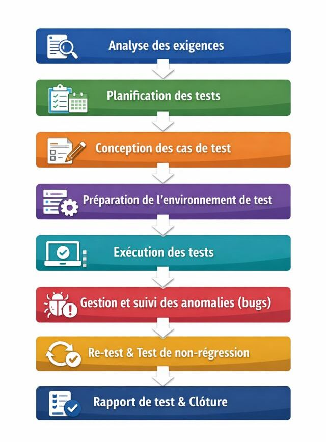

# Memento

Questions et réponses pour entretien

<!-- 

    
Hello
 
    
World !

 -->

<!-- <ul>
    <li></li>
    <li></li>
    <li></li>
    <li></li>
    <li></li>
</ul> -->

## 🫂 Soft skills

    
Quelles sont les qualités d'un bon testeur ?
 
    
Devenir un bon testeur logiciel repose sur une combinaison de rigueur, curiosité technique et excellentes compétences en communication. Le rôle va bien au-delà de l’exécution de tests : il s’agit d’être un garant de la qualité en détectant les anomalies, en comprenant les attentes utilisateurs et en collaborant étroitement avec les développeurs. Une bonne formation, une veille technologique constante et l’acquisition de certifications reconnues comme l’ISTQB sont des leviers clés pour exceller dans ce métier en pleine expansion.

    
Conseils et astuces pour devenir un bon testeur
 
    <ul>
        <li>Comprendre le cycle de développement logiciel : Apprenez les différentes phases (conception, développement, test, déploiement) et le rôle du testeur à chaque étape.</li>
        <li>Acquérir les bases techniques : Formez-vous aux langages de programmation, aux bases de données, aux réseaux et aux protocoles web pour mieux comprendre les applications testées.</li>
        <li>Maîtriser les types de tests : Apprenez à réaliser des tests fonctionnels, non fonctionnels (performance, sécurité), manuels et automatisés.</li>
        <li>Développer des cas de test solides : Apprenez à analyser les spécifications, à concevoir des scénarios de test exhaustifs et à couvrir les cas d’utilisation réels et limites.</li>
        <li>Utiliser les outils de test : Pratiquez avec des outils comme Jira pour le suivi de bugs, Selenium pour l’automatisation, et TestRail pour la gestion des tests.</li>
        <li>Documenter et communiquer efficacement : Rédigez des rapports de test clairs, précis et complets, et soyez capable d’expliquer les bugs aux développeurs de manière constructive.</li>
        <li>Adopter une attitude proactive : Soyez créatif dans la recherche de bugs, sortez des sentiers battus, et proposez des améliorations de processus.</li>
        <li>Travailler en équipe : Collaborez activement avec les développeurs, chefs de projet et autres parties prenantes dans un esprit agile.</li>
        <li>Se certifier : Préparez la certification ISTQB pour valider vos compétences et renforcer votre crédibilité professionnelle.</li>
        <li>Apprendre en continu : Restez à jour avec les nouvelles technologies, frameworks et bonnes pratiques via des blogs, webinaires et communautés de testeurs.</li>
    </ul>

## 🪲 Général

    
Cycle de vie d'un QA ?
 
    

    
Qu'est-ce qu'une solide culture QA ?
 
    

        Une solide culture QA (Quality Assurance) est un ensemble de pratiques, valeurs et mentalités qui place la qualité au cœur du processus de développement. Voici ses caractéristiques principales :
    <h2>Principes fondamentaux:</h2>
    <ul>
        <li><strong>Responsabilité partagée</strong>: La qualité n'est pas uniquement la responsabilité de l'équipe QA, mais de tous (développeurs, product managers, designers)</li>
        <li><strong>Prévention plutôt que détection</strong>: Anticiper les problèmes en amont plutôt que de les corriger après coup</li>
        <li><strong>Tests continus </strong>: Intégration des tests à chaque étape du développement (CI/CD)</li>
    </ul>
    <h2>Pratiques clés</h2>
    <ul>
        <li><strong>Automatisation</strong>: Tests unitaires, d'intégration et end-to-end automatisés</li>
        <li><strong>Documentation</strong>: Spécifications claires, critères d'acceptation bien définis</li>
        <li><strong>Feedback rapide</strong>: Boucles de retour courtes pour identifier et corriger rapidement les bugs</li>
        <li><strong>Revues de code</strong>: Validation par les pairs avant intégration</li>
        <li><strong>Tests exploratoires</strong>: Compléter l'automatisation par des tests manuels créatifs</li>
    </ul>
    <h2>Mentalité</h2>
    <ul>    
        <li><strong>Culture du "shift-left" </strong>: Impliquer la QA dès la conception, pas seulement en fin de cycle</li>
        <li><strong>Amélioration continue</strong>: Rétrospectives régulières, analyse des incidents</li>
        <li><strong>Transparence</strong>: Communication ouverte sur les problèmes de qualité</li>
        <li><strong>Empathie utilisateur </strong>: Toujours penser à l'expérience finale</li>
    </ul>
    
Une solide culture QA réduit les bugs en production, accélère les livraisons et améliore la satisfaction client.

    
Qu'est-ce que le test logiciel ?
 
    
Le test ogiciel consiste à vérifier que le logiciel répond aux exigences, fonctionne correctement et apporte de la valeur à l'utilisateur tout en détectant les anomalies.

    
Quelle est la différence entre bug, défaut et erreur ?
 
    <ul>
        <li><strong>Erreur</strong>: faute humaine (développeur, PO, QA)</li>
        <li><strong>Défaut / Bug</strong>: anomalie dans le code</li>
        <li><strong>Défaillance</strong>: comportement incorrect observé à l'exécution</li>
    </ul>

    
Astuce pour rédiger un plan de test
 
    <ul>
        <li>Quoi ?</li>
        <li>Comment ?</li>
        <li>Quand ?</li>
        <li>Qui ?</li>
    </ul>

    
Astuce pour rédiger un cas de test
 
    <ul>
        <li>Étapes détaillés</li>
        <li>Données</li>
        <li>Résultat attendus</li>
    </ul>

    
Combien de formats pour écrire un cas de test?
 
    <ul>
        <li>Format classique (préconditions / actions / résultats attendus)</li>
        <li>Format Gherkin (BDD)</li>
    </ul>

    
Quelles sont les raisons d'adopter des techniques de test basées sur l'expérience ?
 
    <ul>
        <li>L’exploitation des connaissances et de l’intuition des testeurs expérimentés, notamment sur les points faibles historiques du système.</li>
        <li>La détection de défauts dans les zones à haut risque ou mal couvertes par d’autres techniques.</li>
        <li>La rapidité d’exécution, car ces techniques ne nécessitent pas de préparation formelle comme l’écriture de cas de test détaillés.</li>
        <li>L’adaptabilité à des situations où les spécifications sont incomplètes ou absentes.</li>
        <li>Le complément idéal aux techniques systématiques (boîte noire ou boîte blanche), en apportant une couverture supplémentaire basée sur le savoir-faire pratique.</li>
    </ul>

    
Qu'est-ce qu'un cachier de charges ? Un document de spécifications ? Quelle est la différence entre les deux ?
 
    
Un cahier des charges est effectivement un document de spécifications. C'est un document contractuel qui définit de manière précise et détaillée les besoins, les exigences et les contraintes d'un projet. Il contient généralement :

    <ul>
        <li>L'objectif du projet et le contexte</li>
        <li>Les spécifications fonctionnelles (ce que doit faire le produit/service)</li>
        <li>Les spécifications techniques (comment cela doit être réalisé)</li>
        <li>Les contraintes (budget, délais, normes à respecter)</li>
        <li>Les critères de qualité et de validation</li>
        <li>Les livrables attendus</li>
        <li>Le cahier des charges sert de référence commune entre le client (qui exprime ses besoins) et le prestataire ou l'équipe projet (qui réalise). Il peut être :
            <ul>
                <li><strong>Fonctionnel:</strong> axé sur les besoins et résultats attendus (le "quoi")</li>
                <li><strong>Technique:</strong> détaillant les solutions et moyens à mettre en œuvre (le "comment")</li>
            </ul>
        </li>
    </ul>
    
C'est un outil essentiel en gestion de projet, que ce soit pour du développement logiciel, de la construction, du design, ou tout autre domaine professionnel. La différence est que le cahier de charges n'est pas modifiable, au contraire des spécifications. Le cachier des charges est le cadre global. Les spécifications fonctionnelles décrivent quoi faire, tandis que les spécifications techniques décrivent comment faire.

    
Quelle est la différence entre un bug majeur et un bug mineur ?
 
    
bug majeur => bug qui touche une fonctionnalité majeure (ex: application plante au démarrage)

    
bug mineur => bug qui touche une fonctionnalité mineur (fautes d'orthographe)

    
Quelle est la différence entre priorité et sévérité ?
 
    
La sévérité est l'impact technique du bug sur le système.   Ex:Bloquant (crash, perte de données), majeur, mineur, cosmétique (UI)

    
La priorité est l'urgence de correction du bug: haute, moyenne, basse. Elle dépend du contexte métier du bug.

    
Quelle est la différence entre tests fonctionnels / non fonctionnels ?
 
    <ul>
        <li><strong>Fonctionnels</strong>: vérifient ce que fait le système par rapport aux exigences</li>
        <li><strong>Non fonctionnels</strong>: performance, sécurité, compatibilité, accessibilité</li>
    </ul>

 

    
Qu'est-ce qu'un test de régression ?
 
    
Un test de régression vérifie que les nouvelles modifications n'ont pas cassé les fonctionnalités existantes.

    
KPI QA importants ?
 
    <ul>
        <li>Taux de couverture</li>
        <li>Taux de réussite</li>
        <li>Nombre de bugs bloquants</li>
        <li>Temps d'exécution</li>
    </ul>

    
Pourquoi toi et pas un autre ?
 
    
Je combine qualité fonctionnelle, automatisation et vision produit, avec une forte capacité d’adaptation et un esprit d’amélioration continue. Je suis un profil polyvalent, je veux monter en compétences en DevOps et l'IA.

    
Qu'est-ce que la couverture de test ?
 
    
La couverture de tests (test coverage) en ISTQB est une mesure qui indique le degré auquel les éléments de test ont été exercés par une suite de tests.

    <h3>Définition clé:</h3>
    
C'est le pourcentage d'éléments testés par rapport au nombre total d'éléments à tester. Elle permet d'évaluer la complétude des tests.

    <h3>Principaux types de couverture:</h3>
    
Couverture structurelle (boîte blanche) :

    <ul>
        <li>Couverture des instructions : % de lignes de code exécutées</li>
        <li>Couverture des branches : % de branches conditionnelles testées</li>
        <li>Couverture des chemins : % de chemins d'exécution testés</li>
    </ul>
       
Couverture fonctionnelle (boîte noire) :

    <ul>
        <li>Couverture des exigences : % d'exigences testées</li>
        <li>Couverture des cas d'utilisation : % de scénarios utilisateurs testés</li>
        <li>Couverture des partitions d'équivalence : % de classes testées</li>
    </ul>
    
Formule de base : Couverture = (Éléments testés / Éléments totaux) × 100%

    
Importance:

    <ul>
        <li>Identifie les zones non testées</li>
        <li>Aide à décider quand arrêter les tests</li>
        <li>Critère de qualité et de sortie (exit criteria)</li>
    </ul>
    
Attention : Une couverture de 100% ne garantit pas l'absence de défauts !

    
Qu'est-ce qu'une stratégie de test?
 
    
Une stratégie de test, ce n’est pas une liste de cas de test. C’est un cadre de décision. Pour être efficace, elle repose sur 5 piliers clés :

    1. Les objectifs
    
Pourquoi teste-t-on ? Réduire le risque ? Sécuriser un flux critique ?

    2. Les risques
    
On ne teste pas tout. On teste ce qui compte vraiment.

    3. Les niveaux et types de tests
    
Un équilibre clair entre unitaires, intégration, E2E, exploratoire, auto

    4. L'organisation et les rôles
    
Qui teste quoi, quand, et avec quelle responsabilité ?

    5. Le pilotage par la valeur
    
Des indicateurs utiles, pas des vanity metrics.

    
Une bonne stratégie de test ne vise pas la couverture maximale, mais la maîtrise du risque.

    
Quand arrêter de tester ?
 
    <ul>
        <li>Comprendre le parcours de l’utilisateur</li>
        <li>Clarifier les hypothèses avec les parties prenantes</li>
        <li>Identifier les parcours à haut risque</li>
        <li>Concevoir des scénarios de test rapides</li>
        <li>Documenter les découvertes pendant l’exploration</li>
    </ul>
    
L’exploration sans structure, c’est deviner.

    
L’exploration structurée, c’est une compétence.

    
Qu’est-ce qui rend un bug critique ?
 
    
Un défaut qui:

    <ul>
        <li>Bloque une fonctionnalité essentielle</li>
        <li>Affecte les revenus</li>
        <li>Perturbe les principaux parcours utilisateurs</li>
        <li>Endommage la confiance des utilisateurs</li>
        <li>N’a pas de solution de contournement</li>
    </ul>
    
La gravité est technique.

    
La criticité est liée à l’impact business.

    
Comment prioriser les tests sous des délais serrés ?
 
    <ul>
        <li>Se concentrer sur les zones à haut risque</li>
        <li>Valider les parcours métier critiques</li>
        <li>Vérifier les intégrations</li>
        <li>Couvrir d’abord les dernières modifications</li>
        <li>Communiquer clairement les risques liés à la mise en production</li>
    </ul>
    
La vitesse sans stratégie crée des bugs en production.

    
Qu’est-ce que le test basé sur les risques ?
 
    
Allouer les efforts de test en fonction de : 
    Risque = Probabilité de défaillance × Impact métier 
    Tout ne nécessite pas un niveau de test équivalent. 
    Les testeurs expérimentés testent plus intelligemment, pas plus longtemps.

## 📈 Agile

    
Quel est le rôle du QA en Agile ?
 
    <ul>
        <li>Participer à la rédaction des User Stories</li>
        <li>Définir les critères d'acceptation (complétes, sans ambiguïtés et testables)
        <li>Tester</li>
        <li>Garantir la qualité avant la livraision</li>
    </ul>

    
Qu'est-ce que la Definition of Done ?
 
    
Ensemble de critères garantissant qu'une User Story est terminée, testée et livrable.

    
Qu'est-ce qu'une User Story ?
 
    
Description simple d'un besion utilisateur:

    
En tant que... je veux.... afin de...

    
Différence entre critère d'acceptation et Definiton of Done ?
 
    

<table class="zxqV+AyRUca+MLhV37xZ3A=="><thead class="vws+0UuF+kO6CYMvFHvtZQ=="><tr class="_2ebVTgiBfkHr-I+WBkJGUw=="><th class="Twce1OmS+ZcG-oo8+adRMg==">Caractéristique</th><th class="Twce1OmS+ZcG-oo8+adRMg==">Critère d'Acceptation</th><th class="Twce1OmS+ZcG-oo8+adRMg==">Définition de "Done" (DoD)</th></tr></thead><tbody class="o4qKFCTY3cX9YjCR2ocmKA=="><tr class="_2ebVTgiBfkHr-I+WBkJGUw=="><td class="Lj1YMIu6HckHEepSU13LHg==" data-label="Caractéristique"><strong>Objectif</strong></td><td class="Lj1YMIu6HckHEepSU13LHg==" data-label="Critère d'Acceptation">Vérifier si une <em>fonctionnalité spécifique</em> répond aux besoins du client/utilisateur.</td><td class="Lj1YMIu6HckHEepSU13LHg==" data-label="Définition de &quot;Done&quot; (DoD)">Définir les <em>conditions générales</em> pour considérer un élément de travail (fonctionnalité, tâche, sprint) comme terminé.</td></tr><tr class="_2ebVTgiBfkHr-I+WBkJGUw=="><td class="Lj1YMIu6HckHEepSU13LHg==" data-label="Caractéristique"><strong>Portée</strong></td><td class="Lj1YMIu6HckHEepSU13LHg==" data-label="Critère d'Acceptation">Spécifique à une fonctionnalité ou une user story.</td><td class="Lj1YMIu6HckHEepSU13LHg==" data-label="Définition de &quot;Done&quot; (DoD)">Applicable à l'ensemble du projet ou du sprint.</td></tr><tr class="_2ebVTgiBfkHr-I+WBkJGUw=="><td class="Lj1YMIu6HckHEepSU13LHg==" data-label="Caractéristique"><strong>Qui les définit ?</strong></td><td class="Lj1YMIu6HckHEepSU13LHg==" data-label="Critère d'Acceptation">Collaboration entre l'équipe de développement, le Product Owner et les utilisateurs/clients.</td><td class="Lj1YMIu6HckHEepSU13LHg==" data-label="Définition de &quot;Done&quot; (DoD)">Définie par l'équipe de développement, souvent en collaboration avec les parties prenantes.</td></tr><tr class="_2ebVTgiBfkHr-I+WBkJGUw=="><td class="Lj1YMIu6HckHEepSU13LHg==" data-label="Caractéristique"><strong>Quand sont-ils utilisés ?</strong></td><td class="Lj1YMIu6HckHEepSU13LHg==" data-label="Critère d'Acceptation">Pendant la phase de développement et de test d'une fonctionnalité.</td><td class="Lj1YMIu6HckHEepSU13LHg==" data-label="Définition de &quot;Done&quot; (DoD)">Avant le début du sprint ou du projet, et régulièrement révisée.</td></tr><tr class="_2ebVTgiBfkHr-I+WBkJGUw=="><td class="Lj1YMIu6HckHEepSU13LHg==" data-label="Caractéristique"><strong>Nature</strong></td><td class="Lj1YMIu6HckHEepSU13LHg==" data-label="Critère d'Acceptation">Décrivent le comportement attendu de la fonctionnalité.</td><td class="Lj1YMIu6HckHEepSU13LHg==" data-label="Définition de &quot;Done&quot; (DoD)">Décrivent les standards de qualité, les processus et les livrables requis.</td></tr><tr class="_2ebVTgiBfkHr-I+WBkJGUw=="><td class="Lj1YMIu6HckHEepSU13LHg==" data-label="Caractéristique"><strong>Exemples de critères d'acceptation</strong></td><td class="Lj1YMIu6HckHEepSU13LHg==" data-label="Critère d'Acceptation">- L'utilisateur peut se connecter avec un email et un mot de passe.  - Le bouton "Soumettre" est activé après avoir rempli tous les champs obligatoires.</td><td class="Lj1YMIu6HckHEepSU13LHg==" data-label="Définition de &quot;Done&quot; (DoD)">- Tout le code est revu par un pair. - Tous les tests unitaires passent. - La documentation est à jour. - Le code est intégré à la branche principale.</td></tr><tr class="_2ebVTgiBfkHr-I+WBkJGUw=="><td class="Lj1YMIu6HckHEepSU13LHg==" data-label="Caractéristique"><strong>Format</strong></td><td class="Lj1YMIu6HckHEepSU13LHg==" data-label="Critère d'Acceptation">Généralement formulés en langage naturel, souvent sous forme de "Given/When/Then".</td><td class="Lj1YMIu6HckHEepSU13LHg==" data-label="Définition de &quot;Done&quot; (DoD)">Liste de points vérifiables.</td></tr><tr class="_2ebVTgiBfkHr-I+WBkJGUw=="><td class="Lj1YMIu6HckHEepSU13LHg==" data-label="Caractéristique"><strong>Focus</strong></td><td class="Lj1YMIu6HckHEepSU13LHg==" data-label="Critère d'Acceptation">Fonctionnalité et expérience utilisateur.</td><td class="Lj1YMIu6HckHEepSU13LHg==" data-label="Définition de &quot;Done&quot; (DoD)">Qualité, stabilité et conformité.</td></tr></tbody></table>

<strong>En résumé :</strong>

<ul>
<li>Les <strong>critères d'acceptation</strong> valident <em>si</em> une fonctionnalité fonctionne comme prévu.</li>
<li>La <strong>définition de "Done"</strong> garantit <em>comment</em> le travail est réalisé et livré.</li>
</ul>

Les deux sont essentiels pour le succès d'un projet Agile.

    
Qu'est-ce qu'un critère d'acceptation ?
 
    
Condition permettant de dire si une User Story est acceptée ou rejetée.

    
Quelle est la différence entre User Story et cas de test ?
 
    <ul>
        <li>User Story: besoin métier</li>
        <li>Cas de test: validation technique / fonctionnelle</li>
    </ul>

    
Qui est responsable de la qualité en Agile ?
 
    
La qualité est une responsabilité collective: développeurs, QA, PO et équipe ensemble

    
Le QA peut-il refuser une User Story ?
 
    
Le QA donne un avis qualité, mais la décision finale revient au Product Owner selon la valeur métier.

    
Que faire si une User Story est mal définie ?
 
    
Il faut demander des clarifications, aider à la définition des critères d'acceptation avant le développement.

    
Peut-on avoir des bugs en production en Agile ?
 
    
Oui, c'est possible. L'agilité vise à réduire le risque, pas à l'éliminer totalement. L'important est la réactivité.

    
Peut-on modifier une User Story pendant le sprint ?
 
    
Oui, si l'impact est maîtriser et validé par le PO, tout en respectant l'objectif du sprint.

    
<strong>Example:</strong>

    
Je travaille comme QA dans une équipe Scrum. Sprint de 2 semaines Produit: application mobile de paiement Une User Story importante arrive en fin de sprint, mais:

    <ul>
        <li>Les critères d'acceptation sont flous</li>
        <li>Le développeur a terminé tard</li>
        <li>Le PO veut livrer quand même</li>
    </ul>
    
Que faire en tant que QA ?

    
Je vérifie d'abord les critères d'acceptation. J'identifie les risques. Je communique clairement avec le PO et l'équipe pour décider si la User Story est livrable ou non.

    
La User Story n'a pas de critères d'acceptation clairs. Que faire ?
 
    
Demander une clarification immédiate avec le PO (3 amigos) et proposer des critères d'acceptation basés sur le besoin métier avant d'exécuter les tests.

    
Que faire si l'on trouve un bug bloquant en fin de sprint ?
 
    
Je le déclare immédiatement. J'évalue la sévérité. J'informe le PO et on décide ensemble s'il faut corriger, reporter ou sortir la User Story du sprint.

    <ul>
        <li>Transparence</li>
        <li>Priorisation métier</li>
        <li>Décision collective</li>
    </ul>    

    
La User Story est livrée avec un bug. Est-ce un échec du QA ?
 
    
Non. Le QA a identifié le risque et informé. La qualité est une responsabilité collective, pas individuelle.

    
Que dire en rétrospective ?
 
    
Expliquer ce qui a bien fonctionné, ce qui a posé problème et proposer des actions concrètes pour améliorer la qualité dès le début du sprint

## 💻 Automatisation

<!-- 

    
Hello
 
    
World !

 -->

<!-- <ul>
    <li></li>
    <li></li>
    <li></li>
    <li></li>
    <li></li>
</ul> -->

    
Pourquoi automatiser les tests ?
 
    <ul>
        <li>Gain de temps</li>
        <li>Réduction des erreurs huamaines</li>
        <li>Exécution répétables</li>
        <li>Meilleure couverture de tests</li>
    </ul>

    
Quels sont les principaux types de tests automatisés en QA ?
 
    
L’automatisation ne se limite pas aux tests E2E. Elle intervient à plusieurs niveaux pour sécuriser la qualité logicielle.L’objectif n’est pas d’automatiser tout, mais d’automatiser au bon niveau.

    <ul>
        <li>Tests unitaires: vérifient les fonctions ou méthodes individuellement</li>
        <li>Tests d’intégration: valident les échanges entre composants (API, services, BDD)</li>
        <li>Tests End-to-End (E2E): reproduisent un parcours utilisateur complet</li>
        <li>Tests de non-régression: garantissent qu’une évolution n’a rien cassé</li>
        <li>Smoke tests: contrôlent rapidement les fonctionnalités essentielles</li>
        <li>Tests UI: vérifient le comportement et l’affichage de l’interface</li>
        <li>Tests API: testent la logique métier sans passer par l’UI</li>
        <li>Tests de performance: mesurent stabilité et temps de réponse</li>
        <li>Tests de sécurité (basique): détectent certaines vulnérabilités connues</li>
        <li>Automatiser, c’est : gagner du temps, limiter les erreurs humaines et sécuriser les releases via la CI/CD</li>
    </ul>

    
Quels types de cas de tests sont favorables à l'automatisation?
 
    <ul>
        <li>TNR (tests de non-regression)</li>
        <li>Tests stables</li>
        <li>Tests répétitifs</li>
        <li>Tests d'acceptation (BDD)</li>
        <li>Tests de la même application sur plusieurs environnements (iOS, mobile)</li>
    </ul>

    
Qu'est-ce que la méthode BDD ?
 
    
La méthode BDD (Behavior-Driven Development) est une approche de développement logiciel qui étend le TDD (Test-Driven Development) en se concentrant sur le comportement attendu de l'application plutôt que sur les tests techniques

    
Principes clés

    <ul>
        <li><strong>Langage naturel</strong> : Les scénarios sont écrits dans un langage compréhensible par tous (développeurs, testeurs, clients) en utilisant la syntaxe Gherkin : 
        - <strong>Given</strong>: contexte   
        - <strong>When</strong>: action effectuée   
        - <strong>Then</strong>: résultat attendu   
       </li>  
       <li><strong>Collaboration</strong> : Encourage la communication entre les équipes techniques et métier pour définir ensemble les comportements attendus</li>
        <li><strong>Documentation vivante</strong> : Les scénarios BDD servent à la fois de spécifications, de tests automatisés et de documentation</li> 
    </ul>

    
Qu'est-ce que le Page Object Model (POM) ?
 
    
Pour minimiser l'impact des changements, adoptez le Page Object Model (POM) afin de centraliser les sélecteurs et les actions, ce qui facilite la maintenance des scripts.

    
Différence entre Selenium / Cypress / Playwright ?
 
    

    
<table class="zxqV+AyRUca+MLhV37xZ3A=="><thead class="vws+0UuF+kO6CYMvFHvtZQ=="><tr class="_2ebVTgiBfkHr-I+WBkJGUw=="><th class="Twce1OmS+ZcG-oo8+adRMg==">Critère</th><th class="Twce1OmS+ZcG-oo8+adRMg==">Selenium</th><th class="Twce1OmS+ZcG-oo8+adRMg==">Cypress</th><th class="Twce1OmS+ZcG-oo8+adRMg==">Playwright</th></tr></thead><tbody class="o4qKFCTY3cX9YjCR2ocmKA=="><tr class="_2ebVTgiBfkHr-I+WBkJGUw=="><td class="Lj1YMIu6HckHEepSU13LHg==" data-label="Critère"><strong>Année de création</strong></td><td class="Lj1YMIu6HckHEepSU13LHg==" data-label="Selenium">2004</td><td class="Lj1YMIu6HckHEepSU13LHg==" data-label="Cypress">2015</td><td class="Lj1YMIu6HckHEepSU13LHg==" data-label="Playwright">2020</td></tr><tr class="_2ebVTgiBfkHr-I+WBkJGUw=="><td class="Lj1YMIu6HckHEepSU13LHg==" data-label="Critère"><strong>Langages supportés</strong></td><td class="Lj1YMIu6HckHEepSU13LHg==" data-label="Selenium">Java, Python, C#, JavaScript, Ruby, etc.</td><td class="Lj1YMIu6HckHEepSU13LHg==" data-label="Cypress">JavaScript/TypeScript uniquement</td><td class="Lj1YMIu6HckHEepSU13LHg==" data-label="Playwright">JavaScript, Python, Java, C#</td></tr><tr class="_2ebVTgiBfkHr-I+WBkJGUw=="><td class="Lj1YMIu6HckHEepSU13LHg==" data-label="Critère"><strong>Navigateurs</strong></td><td class="Lj1YMIu6HckHEepSU13LHg==" data-label="Selenium">Chrome, Firefox, Safari, Edge, IE</td><td class="Lj1YMIu6HckHEepSU13LHg==" data-label="Cypress">Chrome, Firefox, Edge (limité)</td><td class="Lj1YMIu6HckHEepSU13LHg==" data-label="Playwright">Chrome, Firefox, Safari, Edge</td></tr><tr class="_2ebVTgiBfkHr-I+WBkJGUw=="><td class="Lj1YMIu6HckHEepSU13LHg==" data-label="Critère"><strong>Architecture</strong></td><td class="Lj1YMIu6HckHEepSU13LHg==" data-label="Selenium">WebDriver (hors navigateur)</td><td class="Lj1YMIu6HckHEepSU13LHg==" data-label="Cypress">Exécution dans le navigateur</td><td class="Lj1YMIu6HckHEepSU13LHg==" data-label="Playwright">Protocole DevTools (hors navigateur)</td></tr><tr class="_2ebVTgiBfkHr-I+WBkJGUw=="><td class="Lj1YMIu6HckHEepSU13LHg==" data-label="Critère"><strong>Vitesse</strong></td><td class="Lj1YMIu6HckHEepSU13LHg==" data-label="Selenium">Moyenne</td><td class="Lj1YMIu6HckHEepSU13LHg==" data-label="Cypress">Rapide</td><td class="Lj1YMIu6HckHEepSU13LHg==" data-label="Playwright">Très rapide</td></tr><tr class="_2ebVTgiBfkHr-I+WBkJGUw=="><td class="Lj1YMIu6HckHEepSU13LHg==" data-label="Critère"><strong>Installation</strong></td><td class="Lj1YMIu6HckHEepSU13LHg==" data-label="Selenium">Complexe (drivers requis)</td><td class="Lj1YMIu6HckHEepSU13LHg==" data-label="Cypress">Simple (npm)</td><td class="Lj1YMIu6HckHEepSU13LHg==" data-label="Playwright">Simple (npm, auto-installation)</td></tr><tr class="_2ebVTgiBfkHr-I+WBkJGUw=="><td class="Lj1YMIu6HckHEepSU13LHg==" data-label="Critère"><strong>Tests parallèles</strong></td><td class="Lj1YMIu6HckHEepSU13LHg==" data-label="Selenium">Oui (avec configuration)</td><td class="Lj1YMIu6HckHEepSU13LHg==" data-label="Cypress">Payant (Cypress Cloud)</td><td class="Lj1YMIu6HckHEepSU13LHg==" data-label="Playwright">Natif et gratuit</td></tr><tr class="_2ebVTgiBfkHr-I+WBkJGUw=="><td class="Lj1YMIu6HckHEepSU13LHg==" data-label="Critère"><strong>Multi-onglets/fenêtre</strong></td><td class="Lj1YMIu6HckHEepSU13LHg==" data-label="Selenium">Oui</td><td class="Lj1YMIu6HckHEepSU13LHg==" data-label="Cypress">Non</td><td class="Lj1YMIu6HckHEepSU13LHg==" data-label="Playwright">Oui</td></tr><tr class="_2ebVTgiBfkHr-I+WBkJGUw=="><td class="Lj1YMIu6HckHEepSU13LHg==" data-label="Critère"><strong>Attente automatique</strong></td><td class="Lj1YMIu6HckHEepSU13LHg==" data-label="Selenium">Non (explicite requise)</td><td class="Lj1YMIu6HckHEepSU13LHg==" data-label="Cypress">Oui</td><td class="Lj1YMIu6HckHEepSU13LHg==" data-label="Playwright">Oui</td></tr><tr class="_2ebVTgiBfkHr-I+WBkJGUw=="><td class="Lj1YMIu6HckHEepSU13LHg==" data-label="Critère"><strong>Débogage</strong></td><td class="Lj1YMIu6HckHEepSU13LHg==" data-label="Selenium">Difficile</td><td class="Lj1YMIu6HckHEepSU13LHg==" data-label="Cypress">Excellent (time-travel)</td><td class="Lj1YMIu6HckHEepSU13LHg==" data-label="Playwright">Excellent (traces, vidéos)</td></tr><tr class="_2ebVTgiBfkHr-I+WBkJGUw=="><td class="Lj1YMIu6HckHEepSU13LHg==" data-label="Critère"><strong>API testing</strong></td><td class="Lj1YMIu6HckHEepSU13LHg==" data-label="Selenium">Non natif</td><td class="Lj1YMIu6HckHEepSU13LHg==" data-label="Cypress">Oui</td><td class="Lj1YMIu6HckHEepSU13LHg==" data-label="Playwright">Oui</td></tr><tr class="_2ebVTgiBfkHr-I+WBkJGUw=="><td class="Lj1YMIu6HckHEepSU13LHg==" data-label="Critère"><strong>Mobile</strong></td><td class="Lj1YMIu6HckHEepSU13LHg==" data-label="Selenium">Oui (avec Appium)</td><td class="Lj1YMIu6HckHEepSU13LHg==" data-label="Cypress">Non</td><td class="Lj1YMIu6HckHEepSU13LHg==" data-label="Playwright">Oui (émulation)</td></tr><tr class="_2ebVTgiBfkHr-I+WBkJGUw=="><td class="Lj1YMIu6HckHEepSU13LHg==" data-label="Critère"><strong>Communauté</strong></td><td class="Lj1YMIu6HckHEepSU13LHg==" data-label="Selenium">Très large (mature)</td><td class="Lj1YMIu6HckHEepSU13LHg==" data-label="Cypress">Grande et active</td><td class="Lj1YMIu6HckHEepSU13LHg==" data-label="Playwright">Croissante rapidement</td></tr><tr class="_2ebVTgiBfkHr-I+WBkJGUw=="><td class="Lj1YMIu6HckHEepSU13LHg==" data-label="Critère"><strong>Courbe d'apprentissage</strong></td><td class="Lj1YMIu6HckHEepSU13LHg==" data-label="Selenium">Élevée</td><td class="Lj1YMIu6HckHEepSU13LHg==" data-label="Cypress">Moyenne</td><td class="Lj1YMIu6HckHEepSU13LHg==" data-label="Playwright">Moyenne</td></tr></tbody></table>

    
<strong>Recommandation</strong> : Playwright pour les nouveaux projets (moderne, complet), Cypress pour la simplicité JavaScript, Selenium pour les projets legacy ou multi-langages établis.

### 🔸Appium

    
Qu'est-ce que Appium ?
 
    
Appium est un outil open-source permettant d’automatiser les tests mobiles Android et iOS, natifs, hybrides et web.

    
Pourquoi choisir Appium ?
 
    <ul>
        <li>Cross-platform</li>
        <li>Même code pour Android & iOS</li>
        <li>Support multi-langages</li>
        <li>Compatible CI/CD</li>
    </ul>

    
Architecture Appium ?
 
    <ul>
        <li>1.  **Client --> Serveur Appium:** Requête HTTP (JSON)</li>
        <li>2.  **Serveur Appium --> Appareil/Simulateur:** Commandes natives</li>
        <li>3.  **Appareil/Simulateur --> Serveur Appium:** Réponse (JSON)</li>
        <li>4.  **Serveur Appium --> Client:** Réponse (JSON)</li>
    </ul>

### 🔸CI / CD

    
Qu'est que CI/CD ?
 
    
<table class="zxqV+AyRUca+MLhV37xZ3A=="><thead class="vws+0UuF+kO6CYMvFHvtZQ=="><tr class="_2ebVTgiBfkHr-I+WBkJGUw=="><th class="Twce1OmS+ZcG-oo8+adRMg==">Caractéristique</th><th class="Twce1OmS+ZcG-oo8+adRMg==">Intégration continue (CI)</th><th class="Twce1OmS+ZcG-oo8+adRMg==">Déploiement continu (CD)</th><th class="Twce1OmS+ZcG-oo8+adRMg==">Continuous Deployment</th></tr></thead><tbody class="o4qKFCTY3cX9YjCR2ocmKA=="><tr class="_2ebVTgiBfkHr-I+WBkJGUw=="><td class="Lj1YMIu6HckHEepSU13LHg==" data-label="Caractéristique"><strong>Objectif</strong></td><td class="Lj1YMIu6HckHEepSU13LHg==" data-label="Continuous Integration (CI)">Intégration fréquente du code</td><td class="Lj1YMIu6HckHEepSU13LHg==" data-label="Continuous Delivery (CD)">Automatisation de la mise à disposition</td><td class="Lj1YMIu6HckHEepSU13LHg==" data-label="Continuous Deployment">Automatisation du déploiement en production</td></tr><tr class="_2ebVTgiBfkHr-I+WBkJGUw=="><td class="Lj1YMIu6HckHEepSU13LHg==" data-label="Caractéristique"><strong>Automatisation</strong></td><td class="Lj1YMIu6HckHEepSU13LHg==" data-label="Continuous Integration (CI)">Tests unitaires, tests d'intégration</td><td class="Lj1YMIu6HckHEepSU13LHg==" data-label="Continuous Delivery (CD)">Déploiement en environnement de test/pré-production</td><td class="Lj1YMIu6HckHEepSU13LHg==" data-label="Continuous Deployment">Déploiement en production</td></tr><tr class="_2ebVTgiBfkHr-I+WBkJGUw=="><td class="Lj1YMIu6HckHEepSU13LHg==" data-label="Caractéristique"><strong>Intervention humaine</strong></td><td class="Lj1YMIu6HckHEepSU13LHg==" data-label="Continuous Integration (CI)">Minimale</td><td class="Lj1YMIu6HckHEepSU13LHg==" data-label="Continuous Delivery (CD)">Possible pour le déploiement final</td><td class="Lj1YMIu6HckHEepSU13LHg==" data-label="Continuous Deployment">Nulle</td></tr></tbody></table>

    
Outils CI/CD ?
 
    <ul>
        <li>Jenkins</li>
        <li>GitLab CI/CD</li>
        <li>GitHub Actions</li>
        <li>CircleCI</li>
        <li>Travis CI</li>
        <li>Azure DevOps</li>
        <li>AWS CodePipeline</li>
    </ul>

    
Appium en CI/CD ?
 
    <ul>
        <li>Exécution automatique des tests mobiles</li>
        <li>Génération de rapports</li>
        <li>Détection rapide des régressions</li>
    </ul>

### 🔸Cucumber

    
Qu'est-ce que Cucumber ?
 
    
Cucumber est un framework open source conçu pour le Behavior-Driven Development (BDD), une méthodologie de développement logiciel qui encourage la collaboration entre développeurs, testeurs, chefs de produit et parties prenantes métier.  Il permet d'écrire des spécifications exécutables en langage naturel, compréhensibles par tous, afin de définir le comportement attendu d'une application.

    
Développé initialement en Ruby, Cucumber est aujourd'hui disponible pour plusieurs langages, notamment Java, JavaScript, .NET, et Python.  Il utilise un langage spécifique appelé Gherkin pour décrire les fonctionnalités et scénarios de test.

    
Le principe fondamental du BDD est de formuler les exigences sous forme d’exemples concrets, ce qui réduit les ambiguïtés et aligne les attentes entre les équipes techniques et fonctionnelles.

    
Fonctionnalités et syntaxe Gherkin
 
    
Gherkin est un langage DSL (Domain-Specific Language) simple et lisible, utilisé pour écrire les fichiers .feature. Il repose sur une grammaire structurée autour de mots-clés clairs.

    
<table class="svelte-1fz0gqk"><!----><!----><!----><!----><!----><!----><!----><tr class="svelte-1fz0gqk"><!----><!----><!----><!----><!----><!----><!----><td class="short svelte-1fz0gqk"><!----><!----><!---->Mot-clé</td><!----><!----><!----><!----><!----><!----><td class="short svelte-1fz0gqk"><!----><!----><!---->Rôle</td><!----><!----><!----><!----><!----><!----><td class="short svelte-1fz0gqk"><!----><!----><!---->Exemple</td></tr><!----><!----><!----><!----><!----><!----><tr class="svelte-1fz0gqk"><!----><!----><!----><!----><!----><!----><!----><td class="short svelte-1fz0gqk"><!----><!----><!----><!----><code class="svelte-1fz0gqk">Feature</code></td><!----><!----><!----><!----><!----><!----><td class="long svelte-1fz0gqk"><!----><!----><!---->Définit une fonctionnalité du système</td><!----><!----><!----><!----><!----><!----><td class="long svelte-1fz0gqk"><!----><!----><!----><!----><code class="svelte-1fz0gqk">Feature: Connexion à l'application</code></td></tr><!----><!----><!----><!----><!----><!----><tr class="svelte-1fz0gqk"><!----><!----><!----><!----><!----><!----><!----><td class="short svelte-1fz0gqk"><!----><!----><!----><!----><code class="svelte-1fz0gqk">Scenario</code></td><!----><!----><!----><!----><!----><!----><td class="long svelte-1fz0gqk"><!----><!----><!---->Décrit un cas d'usage concret</td><!----><!----><!----><!----><!----><!----><td class="long svelte-1fz0gqk"><!----><!----><!----><!----><code class="svelte-1fz0gqk">Scenario: Connexion réussie avec identifiants valides</code></td></tr><!----><!----><!----><!----><!----><!----><tr class="svelte-1fz0gqk"><!----><!----><!----><!----><!----><!----><!----><td class="short svelte-1fz0gqk"><!----><!----><!----><!----><code class="svelte-1fz0gqk">Given</code></td><!----><!----><!----><!----><!----><!----><td class="long svelte-1fz0gqk"><!----><!----><!---->Établit le contexte initial</td><!----><!----><!----><!----><!----><!----><td class="long svelte-1fz0gqk"><!----><!----><!----><!----><code class="svelte-1fz0gqk">Given L'utilisateur est sur la page de connexion</code></td></tr><!----><!----><!----><!----><!----><!----><tr class="svelte-1fz0gqk"><!----><!----><!----><!----><!----><!----><!----><td class="short svelte-1fz0gqk"><!----><!----><!----><!----><code class="svelte-1fz0gqk">When</code></td><!----><!----><!----><!----><!----><!----><td class="long svelte-1fz0gqk"><!----><!----><!---->Décrit l'action de l'utilisateur</td><!----><!----><!----><!----><!----><!----><td class="long svelte-1fz0gqk"><!----><!----><!----><!----><code class="svelte-1fz0gqk">When L'utilisateur saisit "admin" et "password123"</code></td></tr><!----><!----><!----><!----><!----><!----><tr class="svelte-1fz0gqk"><!----><!----><!----><!----><!----><!----><!----><td class="short svelte-1fz0gqk"><!----><!----><!----><!----><code class="svelte-1fz0gqk">Then</code></td><!----><!----><!----><!----><!----><!----><td class="long svelte-1fz0gqk"><!----><!----><!---->Spécifie le résultat attendu</td><!----><!----><!----><!----><!----><!----><td class="long svelte-1fz0gqk"><!----><!----><!----><!----><code class="svelte-1fz0gqk">Then Un message "Connexion réussie" s'affiche</code></td></tr><!----><!----><!----><!----><!----><!----><tr class="svelte-1fz0gqk"><!----><!----><!----><!----><!----><!----><!----><td class="short svelte-1fz0gqk"><!----><!----><!----><!----><code class="svelte-1fz0gqk">And</code><!----><!----> / <!----><!----><!----><code class="svelte-1fz0gqk">But</code></td><!----><!----><!----><!----><!----><!----><td class="long svelte-1fz0gqk"><!----><!----><!---->Ajoute des conditions ou résultats supplémentaires</td><!----><!----><!----><!----><!----><!----><td class="long svelte-1fz0gqk"><!----><!----><!----><!----><code class="svelte-1fz0gqk">And L'utilisateur est redirigé vers le tableau de bord</code></td></tr></table><!----> 

    <h3>Fonctionnalités avancées</h3>
    <ul class="svelte-1fz0gqk"><!----><!----><!----><!----><!----><!----><!----><li class="svelte-1fz0gqk"><!----><!----><!----><!----><!----><!----><!---->
<!----><!----><!----><!----><!----><!----><!----><strong class="svelte-1fz0gqk"><!----><!----><!----><!----><code class="svelte-1fz0gqk">Background</code></strong><!----><!----> : Permet de définir des étapes exécutées avant chaque scénario d'une fonctionnalité, utile pour éviter la duplication. 
</li><!----><!----><!----><!----><!----><!----><li class="svelte-1fz0gqk"><!----><!----><!----><!----><!----><!----><!---->
<!----><!----><!----><!----><!----><!----><!----><strong class="svelte-1fz0gqk"><!----><!----><!----><!----><code class="svelte-1fz0gqk">Scenario Outline</code></strong><!----><!----> : Permet de paramétrer un scénario et de le répéter avec différents jeux de données via une table <!----><!----><!----><code class="svelte-1fz0gqk">Examples</code><!----><!---->. 
</li><!----><!----><!----><!----><!----><!----><li class="svelte-1fz0gqk"><!----><!----><!----><!----><!----><!----><!---->
<!----><!----><!----><!----><!----><!----><!----><strong class="svelte-1fz0gqk"><!----><!----><!----><!----><code class="svelte-1fz0gqk">@Tags</code></strong><!----><!----> : Permet d’annoter des scénarios ou fonctionnalités pour les filtrer lors de l’exécution (ex: <!----><!----><!----><code class="svelte-1fz0gqk">@smoke</code><!----><!---->, <!----><!----><!----><code class="svelte-1fz0gqk">@regression</code><!----><!---->). </li><!----><!----><!----><!----><!----><!----><li class="svelte-1fz0gqk"><!----><!----><!----><!----><!----><!----><!---->
<!----><!----><!----><!----><!----><!----><!----><strong class="svelte-1fz0gqk"><!----><!----><!----><!----><code class="svelte-1fz0gqk"># Comments</code></strong><!----><!----> : Les commentaires sont ignorés par Cucumber et servent à documenter le fichier. 
    <h3>Fichiers clés</h3>
    <ul>
        <li>
            <code>*.feature:</code> Situés dans <em>src/tests/resources/features</em>, ils décrivent les comportements (Given / When / Then) qui implémentent les étapes de scénarios
        </li>
        <li>
            <strong>Classes de Step Definitions</strong>: contiennent les méthodes annotées
        </li>    
    </ul>

  

    
Bonnes pratiques et optimisations
 
    <ul>
        <li>Écrire des scénarios indépendants : Chaque scénario doit pouvoir s’exécuter seul.</li>
        <li>Utiliser Scenario Outline pour les tests paramétrés.</li>
        <li>Éviter les étapes trop longues : Une étape doit correspondre à une action ou une assertion claire.</li>
        <li>Nommer les scénarios de manière explicite : Ex: Scenario: Échec de connexion avec mot de passe incorrect.</li>
        <li>Utiliser des tags pour organiser les tests : Exécuter uniquement les tests @smoke ou ignorer les @wip (work in progress).</li>
        <li>Maintenir les steps réutilisables : Éviter la duplication de code dans les step definitions. </li>
    </ul>

    
Intégration avec d'autres outils
 
    <ul>
        <li><strong>Selenium WebDriver</strong> : Pour les tests d’interface utilisateur.</li>
        <li><strong>RestAssured / Karate</strong> : Pour les tests d’API REST.</li>
        <li><strong>JUnit / TestNG</strong> : Pour le lancement et la gestion des tests.</li>
        <li><strong>Maven / Gradle</strong> : Pour la gestion des dépendances et l’automatisation.</li>
        <li><strong>Jenkins / GitLab CI</strong> : Pour l’exécution automatisée dans les pipelines.</li>
        <li><strong>Allure / Cucumber Reports</strong> : Pour des rapports visuels riches et interactifs.</li>
    </ul>

### 🔸Cypress

    
Qu'est-ce que Cypress ?
 
    
Cypress est un outil de test de bout en bout (End-to-End) basé sur JavaScript. Il est conçu pour les applications web modernes et permet de tester tout ce qui s'exécute dans un navigateur. Il est rapide, facile à utiliser et ne nécessite pas de configuration complexe comme Selenium.

    
Quelles sont les principales fonctionnalités de Cypress ?
 
    <ul>
        <li>Voyage dans le temps (Time Travel) : Cypress prend des instantanés au fur et à mesure de l'exécution des tests.</li>
        <li>Capacité de débogage : Débogage direct via les outils de développement du navigateur (Chrome DevTools).</li>
        <li>Attente automatique (Automatic Waiting) : Plus besoin d'ajouter des pauses ou des attentes explicites ; Cypress attend que les éléments apparaissent.</li>
        <li>Capture d'écran et Vidéos : Capture automatique lors d'un échec.</li>
    </ul>

    
Quelles sont les limitations de Cypress ?
 
    <ul>
        <li>Il ne supporte pas les tests sur mobile natif (uniquement le web mobile).</li>
        <li>Il ne permet pas de tester sur plusieurs onglets de navigateur simultanément.</li>
        <li>Le support pour Safari et Internet Explorer est limité par rapport à Chrome ou Firefox.</li>
    </ul>    

    
Qu'est-ce que le "Selector Playground" ?
 
    
C'est un outil interactif intégré à l'interface de Cypress qui permet de générer des sélecteurs uniques pour les éléments de votre page. Il aide à trouver le sélecteur le plus robuste (en privilégiant souvent les attributs <u>data-cy</u> ou <u>data-test</u>).

    
Quelle est la différence entre cy.find() et cy.get() ?
 
    <ul>
        <li>cy.get() : Recherche un élément à partir de la racine du document (niveau global).</li>
        <li>cy.find() : Recherche un élément enfant à l'intérieur d'une commande précédente (doit être chaîné).</li>
    </ul>

    
Comment gérer les promesses et l'asynchronisme dans Cypress ?
 
    <h2>Le mécanisme de la Queue</h2>
    <ul>
        <li>Contrairement à une idée reçue, <code>cy.get()</code> ou <code>cy.visit()</code> ne retournent pas des Promesses. Techniquement, les commandes Cypress sont des objets compatibles avec l'interface "Thenable", mais elles sont surtout des éléments d'une file d'attente (Queue).</li>
        <li>Cypress gère l'asynchronisme en interne via une file d'attente de commandes. On n'utilise pas async/await. Si l'on a besoin de manipuler le résultat d'une commande, on utilise .then() :</li>
        <pre>
            cy.get('.bouton').then(($btn) => {  
                const texte = $btn.text();
                // Logique ici
            });
        </pre>
        <li>Une fois que la fonction de test a fini de s'exécuter, Cypress "joue" cette liste une par une.</li>
    </ul>
    <h2>L'architecture: le rôle de Node.js vs le Navigateur</h2>
    <ul>
        <li><strong>Le Navigateur (Le cœur)</strong>: Contrairement à Selenium qui envoie des commandes HTTP à distance, Cypress s'exécute à l'intérieur du navigateur, dans la même boucle d'événement (Event Loop) que votre application. Cela lui permet de surveiller tout ce qui s'y passe en temps réel.</li>
        <li><strong>Node.js (Le support)</strong> : Node.js tourne en arrière-plan pour gérer les tâches hors-navigateur (lire des fichiers, configurer le réseau, prendre des captures d'écran).</li>
    </ul>           
    <h2>L'architecture : Le rôle de Node.js vs le Navigateur</h2>
    
Votre intuition sur Node.js est partiellement correcte, mais l'explication réside dans la séparation des pouvoirs :

    
Le Navigateur (Le cœur) : Contrairement à Selenium qui envoie des commandes HTTP à distance, Cypress s'exécute à l'intérieur du navigateur, dans la même boucle d'événement (Event Loop) que votre application. Cela lui permet de surveiller tout ce qui s'y passe en temps réel.

    
Node.js (Le support) : Node.js tourne en arrière-plan pour gérer les tâches hors-navigateur (lire des fichiers, configurer le réseau, prendre des captures d'écran).

    
C'est cette synchronisation constante entre le processus Node et le navigateur qui permet à Cypress de savoir exactement quand l'application est "occupée" ou "prête".

    <h2>Pourquoi est-ce "Asynchrone" alors ?</h2>
    
Cypress est asynchrone principalement à cause de sa gestion de la ré-tentative (Retry-ability).

    
Lorsqu'on appelle <code>cy.get('.loader')</code>, Cypress ne se contente pas de chercher l'élément une fois. Il lance une boucle asynchrone qui :

    <ul>
        <li>Cherche l'élément.</li>
        <li>Si non trouvé, attend quelques millisecondes.</li>
        <li>Recommence jusqu'à ce que l'élément apparaisse ou que le timeout (souvent 4s) soit atteint.</li>
    </ul>
    
C'est cette nature "non-bloquante" et basée sur le temps qui rend le framework intrinsèquement asynchrone, tout en offrant une syntaxe qui ressemble à du code synchrone pour faciliter la lecture.

    <table style="border:1px solid" data-path-to-node="21"><thead><tr><td>Concept</td><td>Réalité Cypress</td></tr></thead><tbody><tr><td><b data-path-to-node="21,1,0,0" data-index-in-node="0">Promesses ?</b></td><td>Non, c'est une <b data-path-to-node="21,1,1,0" data-index-in-node="15">Queue de commandes</b> gérée de manière déterministe.</td></tr><tr><td><b data-path-to-node="21,2,0,0" data-index-in-node="0">Node.js ?</b></td><td>Oui, pour les tâches système, mais l'exécution réelle est dans le <b data-path-to-node="21,2,1,0" data-index-in-node="66">navigateur</b>.</td></tr><tr><td><b data-path-to-node="21,3,0,0" data-index-in-node="0">Asynchronisme ?</b></td><td>Vient de la gestion des <b data-path-to-node="21,3,1,0" data-index-in-node="24">timeouts</b> et de la <b data-path-to-node="21,3,1,0" data-index-in-node="42">ré-tentative automatique</b>.</td></tr></tbody></table>

    
Que sont les "Fixtures" et comment les utiliser ?
 
    
Les fixtures sont des fichiers (souvent JSON) utilisés pour stocker des données statiques afin de simuler des réponses d'API ou des jeux de données de test. On les charge via cy.fixture('nom_du_fichier').

    
Comment créer une commande personnalisée ?
 
    
Les commandes personnalisées sont définies dans le fichier <u>cypress/support/commands.js</u>. Elles permettent d'éviter la répétition de code (ex: cy.login()).

    <pre>
    Cypress.Commands.add('login', (email, password) => {
        cy.get('#email').type(email);
        cy.get('#password').type(password);
        cy.get('#submit').click();
    });
    </pre>

    
Quelle est la meilleure façon de sélectionner des éléments ?
 
    
Il ne faut pas se baser sur les classes CSS ou les tags HTML qui changent souvent. La recommandation officielle est d'utiliser des attributs dédiés au test : 
    <pre>cy.get('[data-cy="submit-btn"]')</pre>

    
Pourquoi Cypress est-il parfois critiqué ?
 
    <ul>
        <li>Il ne supporte pas le multi-onglets nativement.</li>
        <li>Il est limité à l'exécution dans un seul domaine par test (même si cela s'est assoupli avec cy.origin).</li>
        <li>Il ne supporte pas (encore) tous les navigateurs mobiles de manière native.</li>
    </ul>

    
Comment simuler (stubber) une requête API ?
 
    
On utilise <u>cy.intercept()</u>. Cela permet de surveiller les requêtes réseau et de renvoyer des réponses personnalisées sans toucher au vrai backend.

    
Quelle difference entre Cypress et Postman pour tester une API ?
 
    
Cypress et Postman sont tous deux utilisés pour tester des API, mais ils diffèrent par leur objectif et leurs fonctionnalités :
  
    
Postman est un outil dédié aux tests d'API, idéal pour explorer, développer et valider manuellement des endpoints. Il permet d'envoyer des requêtes HTTP, de sauvegarder des collections, d'automatiser des tests via des scripts et de générer de la documentation. Il fonctionne indépendamment de l'interface utilisateur.
 
    
Cypress, en revanche, est principalement un outil de test end-to-end pour les applications web.  Il peut tester des API via cy.request() ou cy.intercept(), mais son objectif principal est de valider l'interaction entre l'UI et les API. Il excelle dans les tests automatisés qui combinent navigation, actions utilisateur et vérification des appels réseau.
 
    
En résumé :

    <ul>
        <li>👉 Postman = test d'API pur, manuel ou automatisé.</li>
        <li>👉 Cypress = test d'interface avec vérification des appels API en contexte utilisateur. </li>
    </ul>    

    
Comment débugger un test ?
 
    <ul>
        <li>Utiliser <code>cy.log()</code> pour imprimer des messages dans la console Cypress.</li>
        <li>Utiliser <code>.debug()</code> ou <code>.pause()</code> dans le code pour arrêter l'exécution</li>
        <li>Consulter les captures d'écran et vidéos générées automatiquement dans le dossier <code>cypress/screenshots.</code></li>
    </ul>

    
On vous demande d’automatiser une fonctionnalité qui n’est pas encore entièrement développée. Comment gérez-vous cela ?
 
    
Utilisez des stubs ou des mocks pour simuler les comportements manquants.

    <pre>
        cy.intercept('POST', '/api/login', { statusCode: 200, body: { token: 'fake-token' } }).as('login');
        cy.visit('/login');
        cy.get('#username').type('test');
        cy.get('#password').type('pass');
        cy.get('button').click();
        cy.wait('@login');
    </pre>

    
Si un test échoue, quelle sera votre prochaine étape ?
 
    
Etapes: Vérifiez les logs, utilisez <code>cy.pause()</code>, ou <code>cy.screenshot()</code> pour déboguer.

    
Si l’application subit de légères modifications, quelle serait votre approche pour modifier les scripts d’automatisation ?
 
    <pre>
        // pageObjects/LoginPage.js
        class LoginPage {
            visit() { 
                cy.visit('/login'); 
            }    
        }
        enterUsername(username) { 
            cy.get('[data-testid="username"]').type(username); 
        }
    </pre>

    
Comment automatiseriez-vous la fonctionnalité de connexion sur un site web ?
 
    <pre>
        cy.get('[data-testid="username"]').type('user123');
        cy.get('[data-testid="password"]').type('pass456');
        cy.get('[data-testid="login-btn"]').click();
        cy.url().should('include', '/dashboard');
    </pre>

    
Comment automatiseriez-vous un scénario où vous devez vérifier si un e-mail est envoyé après l’inscription d’un utilisateur ?
 
    
<strong>Outil externe</strong> : Utilisez un service comme Mailtrap ou Cypress Mailhog.

    <pre>
        cy.request('GET', 'https://mailtrap.io/api/messages').then((response) => {
            expect(response.body.messages.to).to.include('user@example.com');
        });
    </pre>

    
Si un scénario prend beaucoup de temps à s’exécuter, préféreriez-vous TestNG manuel ou l’automatisation ?
 
    
<strong>Scénario lent</strong> → Automatisation ou manuel ?

    
Choix : Automatisation avec optimisation (attentes intelligentes, parallelisation).

    <pre>
        cy.get('#loading-spinner', { timeout: 10000 }).should('not.exist');
    </pre>

    
Comment automatiseriez-vous un scénario où vous devez valider le contenu d’un fichier téléchargé après avoir cliqué sur un bouton sur une page web ?
 
    
<strong>Outil</strong> : Utilisez <code>cypress-downloadfile</code> ou <code>cy.readFile()</code>.

    <pre>
        cy.get('#download-btn').click();
        cy.readFile('cypress/downloads/report.csv').should('contain', 'data');
    </pre>

    
Comment automatiseriez-vous un scénario où vous devez vérifier une couleur, une police et la position d’un élément sur une page web ?
 
    <pre>
        cy.get('#header').should('have.css', 'color', 'rgb(255, 0, 0)');
        cy.get('#text').should('have.css', 'font-family', 'Arial');
        cy.get('#element').should('be.visible').and('have.css', 'position', 'absolute');
    </pre>

    
Comment gérez-vous les pop-ups ou les boîtes d’alerte dans votre script d’automatisation ?
 
     <pre>
        cy.on('window:alert', (text) => {
            expect(text).to.contains('Success!');
        });
        cy.get('#trigger-alert').click();
    </pre>

    
Comment automatiseriez-vous un scénario où vous devez vérifier si un utilisateur peut faire défiler une page jusqu’à la section de pied de page ?
 
    <pre>
        cy.get('footer').scrollIntoView().should('be.visible');
    </pre>

    
On vous a demandé d’automatiser une application héritée. Quelle est votre approche ?
 
    
<strong>Approche</strong> : Commencez par les tests critiques, utilisez des selectors stables, et documentez.

    <pre>
        // Exemple : Tester le flux de paiement critique
        cy.get('#checkout-btn').click();
        cy.url().should('include', '/payment');
    </pre>

    
Un script que vous avez écrit fonctionnait bien hier mais échoue aujourd’hui. Comment dépannez-vous cela ?
 
    
<strong>Dépannage</strong> : Vérifiez les changements dans l’UI, les timeouts, ou les dépendances.

    <pre>cy.get('#new-element', { timeout: 15000 }).should('be.visible'); // Augmenter le timeout</pre>

    
Vos scripts d’automatisation s’exécutent lentement. Comment pouvez-vous améliorer la vitesse ?
 
    
<strong>Optimisations</strong> : Évitez les <code>cy.wait()</code> fixes, utilisez <code>cy.request()</code> pour bypasser l'UI, et activez la parallélisation.

    
✅ Attente dynamique:

    <pre>
        cy.get('#dashboard', { timeout: 10000 }).should('be.visible');
    </pre>
    
✅ Bypasser l'UI pour la connexion (plus rapide) :

    <pre>
        // Utiliser cy.request() au lieu de passer par le formulaire
        cy.request('POST', '/api/login', {
            username: 'user123',
            password: 'pass456'
        }).then((response) => {
            window.localStorage.setItem('token', response.body.token);
        });
        cy.visit('/dashboard');
    </pre>
    
✅ Parallélisation avec Cypress Cloud :

    <pre>
        # Lancer les tests en parallèle
        cypress run --record --parallel --key <your-key>
    </pre>
    
✅ Utiliser des fixtures pour éviter les appels API répétitifs :

    <pre>
        cy.fixture('userData').then((user) => {
            cy.get('#username').type(user.name);
            cy.get('#password').type(user.password);
        });
    </pre>

    
Votre script d’automatisation échoue en raison d’un changement dans l’application. Comment gérez-vous cela ?
 
    
<strong>Approche</strong> : Identifiez le changement (UI, API, données), mettez à jour les sélecteurs ou les intercepteurs.

    
✅ Mettre à jour un sélecteur obsolète :

    <pre>
        // ❌ Ancien sélecteur fragile
        cy.get('.btn-old-class').click();
        // ✅ Nouveau sélecteur robuste avec data-testid
        cy.get('[data-testid="submit-btn"]').click();
    </pre>
    
✅ Adapter un intercepteur suite à un changement d'API :

    <pre>
        // ❌ Ancienne route
        cy.intercept('POST', '/api/v1/login', { statusCode: 200 }).as('login');
        // ✅ Nouvelle route après changement
        cy.intercept('POST', '/api/v2/login', {
        statusCode: 200,
        body: { token: 'new-token' }
        }).as('login');
        cy.wait('@login').its('response.statusCode').should('eq', 200);
    </pre>
    
✅ Utiliser des variables centralisées pour faciliter les mises à jour :

    <pre>
        // cypress/support/constants.js
        export const ROUTES = {
        LOGIN: '/api/v2/login',
        DASHBOARD: '/dashboard'
        };
        // Dans le test
        import { ROUTES } from '../support/constants';
        cy.intercept('POST', ROUTES.LOGIN).as('login');
        cy.visit(ROUTES.DASHBOARD);
    </pre>

### 🔸Playwright

    
Citez quelques bonnes pratiques globales Playwright

    <ul>
        <li>Utilisez toujours le <strong>POM (Page Object Model)</strong> pour la maintenabilité</li>
        <li>Privilégiez getByTestId()</code>, getByRole()</code>, getByLabel()</code> aux sélecteurs CSS fragiles</li>
        <li>Activez les <strong>traces</strong> et <strong>screenshots</strong> automatiques en cas d'échec</li>
        <li>Utilisez storageState</code> pour réutiliser l'authentification entre les tests</li>
    </ul>

    
Expliquer deux avantages clés de l'utilisation de Playwright
 
    <ol>
        <li>Attentes automatiques (auto-waits) : Playwright attend automatiquement que les éléments soient prêts avant d’interagir avec eux (cliquer, saisir, etc.), ce qui réduit considérablement les échecs aléatoires des tests et améliore leur fiabilité.</li>
        <li>Compatibilité multi-navigateurs : Il prend en charge Chromium, Firefox et WebKit, permettant d’exécuter les mêmes tests sur plusieurs navigateurs sans modification, ce qui garantit une couverture de test complète et cohérente.</li>
    </ol>

    
Décrire la relation entre Browser, Browser Context et Page
 
    <ul>
        <li>Browser : Représente une instance complète du navigateur (Chromium, Firefox, WebKit). C’est le conteneur principal, lancé une fois par session de test.</li>
        <li>Browser Context : C’est un environnement isolé à l’intérieur du navigateur. Plusieurs contextes peuvent coexister dans un même navigateur, chacun avec ses propres cookies, stockage local, etc. — idéal pour simuler des utilisateurs distincts.</li>
        <li>Page : C’est une fenêtre ou onglet dans un contexte. Chaque page représente une instance de navigation (ex. : une page web ouverte). Plusieurs pages peuvent exister dans un même contexte, mais elles partagent son état (comme les cookies).</li>
    </ul>
    
En résumé : Browser → Browser Context → Page = hiérarchie d’isolation et de gestion des sessions.

    
Expliquer l’utilité de deux fonctionnalités clés de Playwright :
 
    <ol>
        <li><strong>Outil Codegen (Générateur de code)</strong>: Il permet d’enregistrer vos actions dans le navigateur (cliquer, saisir, naviguer…) et de générer automatiquement le code Playwright correspondant en JavaScript, TypeScript, Python ou Java. Idéal pour démarrer rapidement des tests sans écrire manuellement chaque étape.</li>
        <li><strong>Interception réseau (Network Interception)</strong>: 
        Permet d’intercepter, modifier ou bloquer les requêtes réseau (XHR, fetch, chargement de ressources…). Utile pour simuler des erreurs, tester des réponses spécifiques, ou éviter de charger des ressources externes inutiles pendant les tests.
        </li>
    </ol>
    
Ces outils accélèrent le développement et améliorent la robustesse des tests automatisés.

    
Expliquer une fonctionnalité clé de Playwright pour déboguer les tests défaillants
 
    
<strong>Tracing (Traçage)</strong> Playwright peut enregistrer une trace complète de l'exécution du test, incluant les captures d'écran, les vidéos, les logs réseau, et les événements DOM. Cette trace peut être rejouée ultérieurement dans la visionneuse Playwright Trace Viewer, permettant de voir exactement ce qui s'est passé à chaque étape et d'identifier rapidement la cause de l'échec.

    
Autres fonctionnalités utiles :

    <ul>
        <li>Captures d'écran automatiques : Prises à chaque étape ou en cas d'erreur</li>
        <li>Vidéos : Enregistrement complet de l'exécution du test</li>
        <li>Logs détaillés : Messages de débogage et événements du navigateur</li>
    </ul>
    
Ces outils transforment le débogage en processus transparent et efficace.

    
On vous demande d’automatiser une fonctionnalité qui n’est pas encore entièrement développée. Comment gérez-vous cela ?
 
    
<strong>Approche</strong> : Utilisez page.route() pour mocker les endpoints manquants.

    <pre>
        import { test, expect } from '@playwright/test';

            test('Fonctionnalité non développée - Mock API', async ({ page }) => {
            // Simuler une réponse API non encore développée
            await page.route('/api/new-feature', route => route.fulfill({
                status: 200,
                body: JSON.stringify({ message: 'Feature simulée' })
            }));

            await page.goto('/new-feature');
            await expect(page.getByText('Feature simulée')).toBeVisible();
        });
    </pre>

    
Si un test échoue, quelle sera votre prochaine étape ?
 
    
<strong>Approche</strong> : Utilisez les screenshots, vidéos et traces pour diagnostiquer.

    <pre>
        test('Débogage en cas d\'échec', async ({ page }) => {
            await page.goto('/login');
            // Screenshot manuel en cas d'erreur
            try {
                await page.click('[data-testid="submit-btn"]');
                await expect(page).toHaveURL('/dashboard');
            } catch (error) {
                await page.screenshot({ path: 'screenshots/failure.png', fullPage: true });
                throw error;
            }
        });
    </pre>
    
✅ Configuration automatique des traces dans playwright.config.ts

    
✅ Visualiser la trace 

    <code>npx playwright show-trace trace.zip</code>

    
Si l’application subit de légères modifications, quelle serait votre approche pour modifier les scripts d’automatisation ?
 
    
<strong>Approche</strong> : Utilisez le Page Object Model (POM) pour centraliser les sélecteurs.

    
Comment automatiseriez-vous la fonctionnalité de connexion sur un site web ?
 
    <pre>
        test('Login utilisateur', async ({ page }) => {
            await page.goto('/login');
            await page.getByTestId('username').fill('user123');
            await page.getByTestId('password').fill('pass456');
            await page.getByTestId('login-btn').click();
            // Vérifier la redirection
            await expect(page).toHaveURL('/dashboard');
            // Vérifier la présence d'un élément du dashboard
            await expect(page.getByTestId('welcome-message')).toBeVisible();
        });
    </pre>
    
✅ Réutiliser l'authentification via storageState :

    <pre>
            // auth.setup.ts
            import { test as setup } from '@playwright/test';
            setup('Authenticate', async ({ page }) => {
                await page.goto('/login');
                await page.getByTestId('username').fill('user123');
                await page.getByTestId('password').fill('pass456');
                await page.getByTestId('login-btn').click();
                await page.context().storageState({ path: 'auth.json' });
            });
            // playwright.config.ts
            export default {
            projects: [
                { name: 'setup', testMatch: /auth.setup.ts/ },
                {
                    name: 'tests',
                    use: { storageState: 'auth.json' },
                    dependencies: ['setup']
                }
            ]
        };
    </pre>

    
Comment automatiseriez-vous un scénario où vous devez vérifier si un e-mail est envoyé après l’inscription d’un utilisateur ?
 
    
<strong>Approche</strong> : Utilisez un service comme Mailhog ou Mailtrap via API.

    <pre>
        test('Vérifier e-mail après inscription', async ({ page, request }) => {
            // Inscription de l'utilisateur
            await page.goto('/register');
            await page.getByTestId('email').fill('testuser@example.com');
            await page.getByTestId('password').fill('pass456');
            await page.getByTestId('register-btn').click();
            // Vérifier via l'API Mailhog
            const emailResponse = await request.get('http://localhost:8025/api/v2/messages');
            const emails = await emailResponse.json();
            expect(emails.items.Content.Headers.To).toContain('testuser@example.com');
            expect(emails.items.Content.Headers.Subject).toContain('Bienvenue');
        });
    </pre>

    
Si un scénario prend beaucoup de temps à s’exécuter, préféreriez-vous TestNG manuel ou l’automatisation ?
 
    
Choix : Automatisation avec des attentes intelligentes et retry.

    <pre>
        test('Scénario long avec attente intelligente', async ({ page }) => {
            await page.goto('/reports');
            // Attendre la disparition du spinner
            await page.waitForSelector('#loading-spinner', { state: 'hidden', timeout: 30000 });
            // Attendre la réponse API
            await page.waitForResponse(
                response => response.url().includes('/api/reports') && response.status() === 200
            );
            await expect(page.getByTestId('report-table')).toBeVisible();
        });
    </pre>
    
✅ Configuration du retry dans playwright.config.ts :

    <pre>
        export default {
            retries: 2, // Relancer automatiquement en cas d'échec
            timeout: 60000,
        };
    </pre>

    
Comment automatiseriez-vous un scénario où vous devez valider le contenu d’un fichier téléchargé après avoir cliqué sur un bouton sur une page web ?
 
    <pre>
        import * as fs from 'fs';
        import * as path from 'path';

        test('Valider un fichier téléchargé', async ({ page }) => {
            await page.goto('/reports');
            // Attendre le téléchargement
            const [download] = await Promise.all([
                page.waitForEvent('download'),
                page.getByTestId('download-btn').click()
            ]);
            // Sauvegarder le fichier
            const filePath = path.join('downloads', download.suggestedFilename());
            await download.saveAs(filePath);
            // Lire et valider le contenu
            const fileContent = fs.readFileSync(filePath, 'utf-8');
            expect(fileContent).toContain('expected data');
            expect(download.suggestedFilename()).toBe('report.csv');
        });
    </pre>

    
Comment automatiseriez-vous un scénario où vous devez vérifier une couleur, une police et la position d’un élément sur une page web ?
 
    <pre>
        test('Vérifier les propriétés CSS d\'un élément', async ({ page }) => {
            await page.goto('/home');
            const header = page.locator('#header');
            // Vérifier la couleur
            const color = await header.evaluate(el =>
                window.getComputedStyle(el).color
            );
            expect(color).toBe('rgb(255, 0, 0)');
            // Vérifier la police
            const fontFamily = await header.evaluate(el =>
                window.getComputedStyle(el).fontFamily
            );
            expect(fontFamily).toContain('Arial');
            // Vérifier la position
            const boundingBox = await header.boundingBox();
            expect(boundingBox?.x).toBeGreaterThan(0);
            expect(boundingBox?.y).toBeGreaterThan(0);
        });
    </pre>

    
Comment gérez-vous les pop-ups ou les boîtes d’alerte dans votre script d’automatisation ?
 
    <pre>
        test('Gérer une alerte native', async ({ page }) => {
            // Intercepter l'alerte avant le clic
            page.on('dialog', async dialog => {
                expect(dialog.message()).toContain('Êtes-vous sûr ?');
                await dialog.accept(); // ou dialog.dismiss() pour annuler
            });
            await page.goto('/settings');
            await page.getByTestId('delete-btn').click();
            });
            // ✅ Gérer une pop-up dans un nouvel onglet
            test('Gérer une pop-up dans un nouvel onglet', async ({ page, context }) => {
            const [popup] = await Promise.all([
                context.waitForEvent('page'),
                page.getByTestId('open-popup-btn').click()
            ]);
            await popup.waitForLoadState();
            await expect(popup.getByTestId('popup-title')).toBeVisible();
            await popup.close();
        });
    </pre>

    
Comment automatiseriez-vous un scénario où vous devez vérifier si un utilisateur peut faire défiler une page jusqu’à la section de pied de page ?
 
    <pre>
        test('Vérifier le défilement jusqu\'au footer', async ({ page }) => {
            await page.goto('/home');
            // Faire défiler jusqu'au footer
            await page.evaluate(() => window.scrollTo(0, document.body.scrollHeight));
            // Ou utiliser scrollIntoViewIfNeeded
            const footer = page.locator('footer');
            await footer.scrollIntoViewIfNeeded();
            // Vérifier la visibilité
            await expect(footer).toBeVisible();
            // Vérifier la position dans le viewport
            const isInViewport = await footer.evaluate(el => {
                const rect = el.getBoundingClientRect();
                return rect.top < window.innerHeight;
            });
            expect(isInViewport).toBeTruthy();
        });
    </pre>

    
On vous a demandé d’automatiser une application héritée. Quelle est votre approche ?
 
    
<strong>Approche</strong> : Utilisez des sélecteurs stables, commencez par les flux critiques.

    <pre>
        test('Application héritée - Flux de connexion critique', async ({ page }) => {
            await page.goto('/legacy-app');
            // Utiliser plusieurs stratégies de sélection
            await page.locator('input[name="username"]').fill('admin');
            await page.locator('input[type="password"]').fill('password');
            // Attendre la navigation après soumission
            await Promise.all([
                page.waitForNavigation(),
                page.locator('input[type="submit"]').click()
            ]);
            // Vérifier un élément stable de l'ancienne app
            await expect(page.locator('#main-menu')).toBeVisible();
        });
    </pre>

    
Un script que vous avez écrit fonctionnait bien hier mais échoue aujourd’hui. Comment dépannez-vous cela ?
 
    
<strong>Dépannage</strong> : Vérifiez les changements UI, les timeouts, et utilisez le mode debug.

    <pre>
        test('Dépannage d\'un script en échec', async ({ page }) => {
            await page.goto('/dashboard');
            // Augmenter le timeout pour un élément lent
            await expect(page.getByTestId('data-table'))
                .toBeVisible({ timeout: 15000 });
            // Vérifier les logs réseau
            page.on('response', response => {
                if (response.status() >= 400) {
                console.error(`Erreur réseau: ${response.url()} - ${response.status()}`);
                }
            });
            // Vérifier les erreurs console
            page.on('console', msg => {
                if (msg.type() === 'error') {
                console.error(`Erreur console: ${msg.text()}`);
                }
            });
        });
    </pre>
    
✅ Lancer en mode debug :

    <pre>
        npx playwright test --debug
        # Ou avec l'UI mode
        npx playwright test --ui
    </pre>

    
Vos scripts d’automatisation s’exécutent lentement. Comment pouvez-vous améliorer la vitesse ?
 
    
<strong>Stratégies</strong> : Utilisez des waitFor intelligents, évitez les attentes fixes, et privilégiez les appels API pour les états critiques.

    
✅ Attente dynamique (pas de sleep) :

    <pre>
        // ❌ À éviter
        await page.waitForTimeout(5000);
        // ✅ Attendre un élément spécifique
        await page.waitForSelector('#dashboard', { timeout: 10000 });
    </pre>
    
✅ Bypasser l’UI via l’API (plus rapide) :

    <pre>
        // Authentification via API
        const response = await page.request.post('/api/login', {
        data: { username: 'user123', password: 'pass456' }
        });
        const token = (await response.json()).token;
        // Injecter le token dans le navigateur
        await page.addInitScript(({ token }) => {
        window.localStorage.setItem('token', token);
        }, { token });
        await page.goto('/dashboard');
    </pre>
    
✅ Utiliser des fixtures (données statiques) :

    <pre>
        // test-data/user.json
        {
        "username": "testuser",
        "password": "testpass"
        }
        // Dans le test
        const userData = JSON.parse(await fs.promises.readFile('./test-data/user.json', 'utf-8'));
        await page.getByTestId('username').fill(userData.username);
        await page.getByTestId('password').fill(userData.password);
    </pre>
    
✅ Parallélisation avec Playwright Test :

    <pre>
    # Lancer les tests en parallèle
    npx playwright test --workers=4
</pre>

    
Votre script d’automatisation échoue en raison d’un changement dans l’application. Comment gérez-vous cela ?
 
    
<strong>Approche</strong> : Identifier le changement (UI, API, structure), mettre à jour les sélecteurs ou les mocks.

    
✅ Mettre à jour un sélecteur obsolète :

    <pre>
        // ❌ Ancien sélecteur
        await page.click('.old-button');
        // ✅ Nouveau sélecteur avec data-testid
        await page.click('[data-testid="submit-btn"]');
    </pre>
    
✅ Adapter un mock API suite à un changement :

    <pre>
        // ❌ Ancienne route
        await page.route('/api/v1/login', route => route.fulfill({ status: 200 }));
        // ✅ Nouvelle route
        await page.route('/api/v2/login', route => route.fulfill({
        status: 200,
        body: JSON.stringify({ token: 'new-token' })
        }));
        await page.goto('/login');
        await page.click('button');
        await page.waitForResponse('/api/v2/login');
    </pre>
    
✅ Utiliser le mode “debug” pour identifier les changements :

    <pre>
        npx playwright test --debug
        # Ou dans le code :
        await page.pause(); // Pause interactive pour inspecter l’UI
    </pre>

## 🌐 API

    
Qu'est-ce qu'une API ?
 
    
Une API permet à deux systèmes de communiquer via HTTP (GET, POST, PUT, DELETE).

    
Quels types de tests faire sur une API ?
 
    <ul>
        <li>Tests fonctionnels</li>
        <li>Tests de statut HTTP</li>
        <li>Tests de sécurité</li>
        <li>Tests de performance</li>
        <li>Tests de validation des données (JSON)</li>
    </ul>

    
Différence entre GET / POST ?
 
    
<strong>GET</strong>

    <ul>
        <li><strong>Usage</strong> : Récupérer des données depuis le serveur</li>
        <li><strong>Paramètres</strong> : Passés dans l'URL (?param1=valeur1&param2=valeur2)</li>
        <li><strong>Visibilité</strong> : Les données sont visibles dans l'URL (historique, logs)</li>
        <li><strong>Mise en cache</strong> : Peut être mis en cache par le navigateur</li>
        <li><strong>Sécurité</strong> : Ne jamais utiliser pour des données sensibles (mots de passe)</li>
        <li><strong>Idempotent</strong> : Appels multiples = même résultat, sans effet de bord</li>
    </ul>
    
<strong>POST</strong>

    <ul>
        <li><strong>Usage</strong> : Envoyer des données au serveur (créer, modifier)</li>
        <li><strong>Paramètres</strong> : Passés dans le corps de la requête (body)</li>
        <li><strong>Visibilité</strong> : Les données ne sont pas visibles dans l'URL</li>
        <li><strong>Mise en cache</strong> : Généralement pas mis en cache</li>
        <li><strong>Sécurité</strong> : Adapté pour les données sensibles (avec HTTPS)</li>
        <li><strong>Non-idempotent</strong> : Peut créer des ressources à chaque appel</li>
    </ul>

    
Outils API ?
 
    
Postman, Swagger

## 🧠 Exercices examen (Logique - Observation - Rigueur)

## 📒 Autres

    
En informatique, que signifie 'comprendre le métier' ? Quelle attitude adopter en tant que QA ?
 
        
En informatique, le terme "métier" fait référence aux activités, processus et règles spécifiques d'un domaine professionnel ou d'une entreprise.

        
On parle souvent de :
  
        <strong>Règles métier :</strong> les contraintes et conditions spécifiques au domaine d'activité      
        <strong>Analyste métier :</strong> un professionnel qui comprend les besoins de l'entreprise et fait le lien avec les développeurs 
        <strong>Application métier :</strong> un logiciel conçu pour répondre aux besoins spécifiques d'une activité professionnelle (comptabilité, gestion RH, etc.)    
        Exemple concret : Dans une banque, le "métier" inclut les règles de calcul d'intérêts, les conditions d'octroi de crédit, les processus de virement, etc. Les développeurs doivent traduire ces règles métier en code informatique.
        C'est donc le "quoi" (ce que fait l'entreprise) par opposition au "comment" (la technologie utilisée pour le faire). 
        Un bon QA se doit de comprendre le métier et ne se limite pas aux specs ou un story mapping. Plongez dans le besoin business, challengez les user stories et mettez-vous à la place des utilisateurs finaux.

<!-- 

    
Hello
 
    
World !

 -->

<!-- <ul>
    <li></li>
    <li></li>
    <li></li>
    <li></li>
    <li></li>
</ul> -->

### ISTQB GenAI Certification Preparation

    
1. Stratégies de Prompting (Ingénierie)
 
    <table-block _nghost-ng-c61304436="" class="ng-star-inserted">

<table data-path-to-node="4"><thead><tr><td>Si la question mentionne...</td><td>La réponse est souvent...</td></tr></thead><tbody><tr><td>"Décomposer étape par étape"</td><td><b data-path-to-node="4,1,1,0" data-index-in-node="0">Chain-of-Thought (CoT)</b></td></tr><tr><td>"Sortie d'un prompt vers l'entrée d'un autre"</td><td><b data-path-to-node="4,2,1,0" data-index-in-node="0">Prompt Chaining</b></td></tr><tr><td>"IA qui joue un rôle (ex: Expert Testeur)"</td><td><b data-path-to-node="4,3,1,0" data-index-in-node="0">Persona Adoption</b></td></tr><tr><td>"IA qui s'auto-évalue ou critique son plan"</td><td><b data-path-to-node="4,4,1,0" data-index-in-node="0">Self-Reflection</b></td></tr><tr><td>"Contraintes sur ce que l'IA ne doit pas faire"</td><td><b data-path-to-node="4,5,1,0" data-index-in-node="0">Negative Prompting</b></td></tr></tbody></table></table-block>

    
2. Métriques & Evaluation
 
    <table data-path-to-node="7"><thead><tr><td>Si la question mentionne...</td><td>La réponse est souvent...</td></tr></thead><tbody><tr><td>"Similarité de sens / Embeddings / Vecteurs"</td><td><b data-path-to-node="7,1,1,0" data-index-in-node="0">BERTScore</b> (ou Cosinus Similarity)</td></tr><tr><td>"Chevauchement exact de mots / N-grammes"</td><td><b data-path-to-node="7,2,1,0" data-index-in-node="0">BLEU</b></td></tr><tr><td>"Qualité des résumés / Rappel des mots-clés"</td><td><b data-path-to-node="7,3,1,0" data-index-in-node="0">ROUGE</b></td></tr><tr><td>"Synonymes / Morphologie / Racines des mots"</td><td><b data-path-to-node="7,4,1,0" data-index-in-node="0">METEOR</b></td></tr><tr><td>"Qualité et diversité d'images"</td><td><b data-path-to-node="7,5,1,0" data-index-in-node="0">FID (Fréchet Inception Distance)</b></td></tr><tr><td>"Succès sur k tentatives de code"</td><td><b data-path-to-node="7,6,1,0" data-index-in-node="0">Pass@k</b></td></tr></tbody></table>

    
3. Architecture & Agents
 
    <table data-path-to-node="10"><thead><tr><td>Si la question mentionne...</td><td>La réponse est souvent...</td></tr></thead><tbody><tr><td>"Accès à des connaissances externes/à jour"</td><td><b data-path-to-node="10,1,1,0" data-index-in-node="0">RAG (Retrieval-Augmented Generation)</b></td></tr><tr><td>"IA qui utilise des API / Navigateur / Python"</td><td><b data-path-to-node="10,2,1,0" data-index-in-node="0">Tool Use / Tool Calling</b></td></tr><tr><td>"IA qui agit seule pour atteindre un but"</td><td><b data-path-to-node="10,3,1,0" data-index-in-node="0">Agent Autonome</b></td></tr><tr><td>"Lien entre une réponse et sa source"</td><td><b data-path-to-node="10,4,1,0" data-index-in-node="0">Grounding (Ancrage)</b></td></tr><tr><td>"Probabilité de prédire le token suivant"</td><td><b data-path-to-node="10,5,1,0" data-index-in-node="0">Perplexité</b> (Perplexity)</td></tr></tbody></table>

    
4. Risques, Sécurité & Biais
 
    <table data-path-to-node="13"><thead><tr><td>Si la question mentionne...</td><td>La réponse est souvent...</td></tr></thead><tbody><tr><td>"L'IA révèle ses instructions système"</td><td><b data-path-to-node="13,1,1,0" data-index-in-node="0">Prompt Leakage</b></td></tr><tr><td>"Attaque via un mail lu par l'IA"</td><td><b data-path-to-node="13,2,1,0" data-index-in-node="0">Indirect Prompt Injection</b></td></tr><tr><td>"Modifier quelques pixels pour tromper l'IA"</td><td><b data-path-to-node="13,3,1,0" data-index-in-node="0">Adversarial Attack (Attaque adverse)</b></td></tr><tr><td>"Données de test qui influencent le modèle"</td><td><b data-path-to-node="13,4,1,0" data-index-in-node="0">Data Poisoning (Empoisonnement)</b></td></tr><tr><td>"L'IA semble trop sûre d'elle (biais humain)"</td><td><b data-path-to-node="13,5,1,0" data-index-in-node="0">Over-reliance (Excès de confiance)</b></td></tr></tbody></table>

    
5. Normes & Régulations
 
    <table data-path-to-node="16"><thead><tr><td>Si la question mentionne...</td><td>La réponse est souvent...</td></tr></thead><tbody><tr><td>"Social Scoring / Manipulation subliminale"</td><td><b data-path-to-node="16,1,1,0" data-index-in-node="0">Risque Inacceptable</b> (EU AI Act)</td></tr><tr><td>"Recrutement / Santé / Justice"</td><td><b data-path-to-node="16,2,1,0" data-index-in-node="0">Haut Risque</b> (EU AI Act)</td></tr><tr><td>"Gouverner, Mapper, Mesurer, Gérer"</td><td><b data-path-to-node="16,3,1,0" data-index-in-node="0">NIST AI Risk Management Framework</b></td></tr><tr><td>"Système de Management de l'IA (SMSIA)"</td><td><b data-path-to-node="16,4,1,0" data-index-in-node="0">ISO/IEC 42001</b></td></tr><tr><td>"Terminologie officielle et définitions"</td><td><b data-path-to-node="16,5,1,0" data-index-in-node="0">ISO/IEC 22989</b></td></tr></tbody></table>

    
6. Techniques de Test Spécifiques
 
    <table data-path-to-node="19"><thead><tr><td>Si la question mentionne...</td><td>La réponse est souvent...</td></tr></thead><tbody><tr><td>"Pas d'Oracle / Relation entre entrées et sorties"</td><td><b data-path-to-node="19,1,1,0" data-index-in-node="0">Metamorphic Testing</b></td></tr><tr><td>"Tester des cas extrêmes ou improbables"</td><td><b data-path-to-node="19,2,1,0" data-index-in-node="0">Boundary Value Analysis (appliqué à l'IA)</b></td></tr><tr><td>"L'IA répare les scripts de test d'UI"</td><td><b data-path-to-node="19,3,1,0" data-index-in-node="0">Self-healing (Auto-réparation)</b></td></tr></tbody></table>

<!-- 

    
Hello
 
    
World !

 -->
